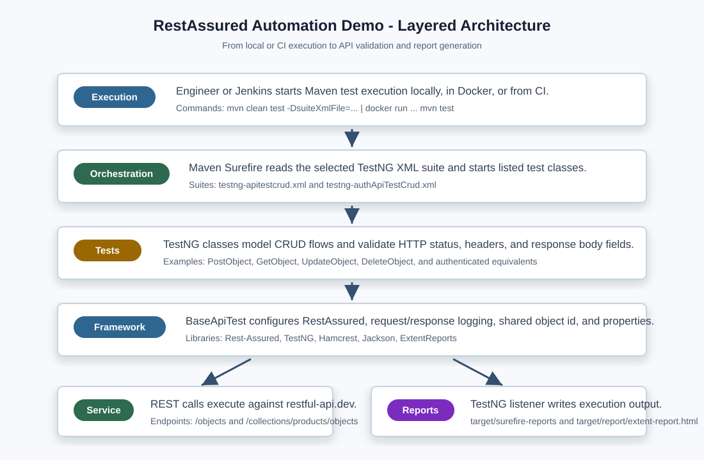
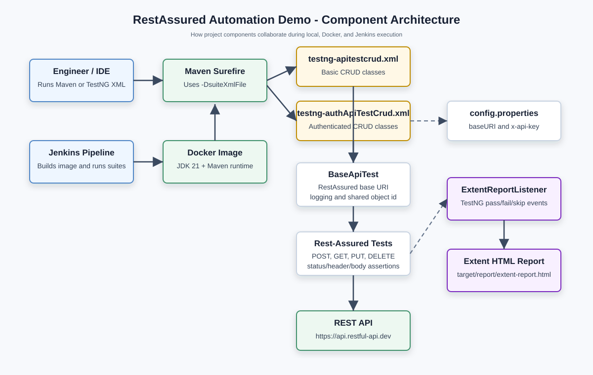

# RestAssured Automation Demo

This project is a Java API test automation framework built with Rest-Assured, TestNG, Maven, ExtentReports, Docker, and Jenkins. It validates CRUD operations against `https://api.restful-api.dev` through two test suites:

- Basic object CRUD tests using `/objects`.
- Authenticated collection CRUD tests using `/collections/products/objects` with an `x-api-key` header.

The framework is intentionally small and direct, so a new engineer can understand the automation flow, run it locally, extend it with new scenarios, and plug it into CI.

## Goal

Provide a repeatable API automation project that verifies REST CRUD behavior, captures useful execution logs, generates HTML reports, and runs consistently across local machines, Docker containers, and Jenkins agents.

## Objectives

- Automate create, read, update, and delete API scenarios using Rest-Assured.
- Organize tests into TestNG suites for basic and authenticated API coverage.
- Externalize authenticated test configuration through `config.properties`.
- Generate execution evidence through Surefire XML reports and Extent HTML reports.
- Support local, IDE, Docker, and Jenkins execution paths.
- Make the project easy for new engineers to inspect, run, debug, and enhance.

## Architecture

### Layered Architecture



### Component Level Architecture



## Tech Stack

| Area | Tool / Library | Purpose |
| --- | --- | --- |
| Language | Java 21 | Test implementation language |
| Build | Maven | Dependency management and test execution |
| API testing | Rest-Assured 6.0.0 | HTTP request execution and response extraction |
| Test framework | TestNG 7.12.0 | Test annotations, suites, lifecycle, and listeners |
| Assertions | Hamcrest 3.0 and TestNG Assert | Status, header, body, and state validation |
| JSON support | Jackson Databind 2.21.2 | JSON data handling support |
| Reporting | ExtentReports 5.1.2 | HTML report generation |
| Logging | Rest-Assured logging filters and SLF4J Simple | Request/response and runtime logs |
| Containerization | Docker | Consistent execution environment |
| CI/CD | Jenkins declarative pipeline | Automated build, test, and artifact publishing |

## Folder Structure

```text
RestAssuredAutomationDemo/
|-- docs/
|   `-- images/
|       |-- layered-architecture.svg
|       `-- component-architecture.svg
|-- src/
|   |-- main/
|   |   `-- java/com/simplilearn/RestAssuredAutomationDemo/
|   |       |-- App.java
|   |       `-- reporting/
|   |           |-- ExtentReportListener.java
|   |           `-- ExtentReportManager.java
|   `-- test/
|       |-- java/com/simplilearn/RestAssuredAutomationDemo/
|       |   |-- ApiTestsCrud/
|       |   |   |-- BaseApiTest.java
|       |   |   |-- PostObject.java
|       |   |   |-- GetObject.java
|       |   |   |-- UpdateObject.java
|       |   |   |-- DeleteObject.java
|       |   |   |-- GetAllObjects.java
|       |   |   |-- GetObjectWithId.java
|       |   |   |-- GetObjectsByIds.java
|       |   |   `-- EndToEndObjectFlowTest.java
|       |   `-- authApiTestsCrud/
|       |       |-- BaseApiTest.java
|       |       |-- GetAllObjectsWithAuth.java
|       |       |-- PostObjectWithAuth.java
|       |       |-- GetObjectWithAuth.java
|       |       |-- UpdateObjectWithAuth.java
|       |       `-- DeleteObjectWithAuth.java
|       `-- resources/
|           `-- config.properties
|-- Dockerfile
|-- Jenkinsfile
|-- pom.xml
|-- testng-apitestcrud.xml
|-- testng-authApiTestCrud.xml
`-- README.md
```

## How The Framework Works

1. A user, IDE, Docker container, or Jenkins pipeline starts Maven with a selected TestNG suite file.
2. Maven Surefire reads `suiteXmlFile` from the command line and launches the matching TestNG XML suite.
3. TestNG loads the Extent report listener configured in the XML suite.
4. TestNG executes the test classes in the order listed in the suite file.
5. `BaseApiTest` configures Rest-Assured before test execution.
6. Test methods use Rest-Assured `given()`, `when()`, and `then()` syntax to call the API.
7. Assertions validate status codes, response headers, and response body fields.
8. Created object IDs are stored in a shared static `objectId` field so later tests can read, update, or delete the same object.
9. TestNG and ExtentReports write execution output into the `target/` directory.

## Prerequisites

- JDK 21 or later.
- Maven 3.9 or later.
- Docker Desktop, if you want containerized execution.
- Jenkins with Docker support, if you want CI execution.
- An IDE such as IntelliJ IDEA, Eclipse, or VS Code.

## Configuration

Authenticated tests read configuration from [src/test/resources/config.properties](src/test/resources/config.properties):

```properties
baseURI=https://api.restful-api.dev
x-api-key=replace-with-your-api-key
```

Important notes:

- The basic CRUD suite currently sets `RestAssured.baseURI` directly in `ApiTestsCrud/BaseApiTest.java`.
- The authenticated CRUD suite loads `baseURI` and `x-api-key` from `config.properties`.
- Do not commit real API keys in shared repositories. Use local configuration, CI secrets, or environment-driven configuration when hardening this project.

## Running Tests Locally

Run the basic CRUD suite:

```bash
mvn clean test -DsuiteXmlFile=testng-apitestcrud.xml
```

Run the authenticated CRUD suite:

```bash
mvn clean test -DsuiteXmlFile=testng-authApiTestCrud.xml
```

Run from an IDE:

1. Import the project as a Maven project.
2. Confirm the project SDK is JDK 21.
3. Open `testng-apitestcrud.xml` or `testng-authApiTestCrud.xml`.
4. Run the XML suite with the IDE TestNG runner.
5. Review console logs and generated reports under `target/`.

## Running Tests With Docker

Build the Docker image:

```bash
docker build -t restassured-automation-demo .
```

Run the basic CRUD suite from PowerShell:

```powershell
docker run --rm -v ${PWD}:/app restassured-automation-demo mvn test -DsuiteXmlFile=testng-apitestcrud.xml
```

Run the authenticated CRUD suite from PowerShell:

```powershell
docker run --rm -v ${PWD}:/app restassured-automation-demo mvn test -DsuiteXmlFile=testng-authApiTestCrud.xml
```

The volume mount maps the repository into `/app` inside the container, so generated reports are available on the host machine after execution.

## Jenkins Execution

The [Jenkinsfile](Jenkinsfile) defines a declarative pipeline with these stages:

| Stage | Responsibility |
| --- | --- |
| Docker Build | Builds the `restassured-automation-demo` image from the Dockerfile |
| Environment Check | Prints Java and Maven versions from inside the image |
| Run CRUD Tests | Runs `testng-apitestcrud.xml` in the container |
| Run Auth Tests | Runs `testng-authApiTestCrud.xml` in the container |
| Post Actions | Publishes Surefire XML results, archives HTML reports, and cleans workspace |

To set up Jenkins:

1. Install Docker on the Jenkins agent.
2. Install required Jenkins plugins such as Pipeline, JUnit, and Docker-related plugins.
3. Create a Pipeline job.
4. Configure it to load the pipeline script from this repository.
5. Set the script path to `Jenkinsfile`.
6. Run the job and inspect archived reports.

## Reports And Logs

After execution, review these outputs:

```text
target/surefire-reports/          TestNG and Maven Surefire execution output
target/report/extent-report.html  Extent HTML report
```

The reporting flow is implemented by:

- [ExtentReportManager.java](src/main/java/com/simplilearn/RestAssuredAutomationDemo/reporting/ExtentReportManager.java), which configures the HTML reporter.
- [ExtentReportListener.java](src/main/java/com/simplilearn/RestAssuredAutomationDemo/reporting/ExtentReportListener.java), which listens to TestNG events and logs pass, fail, skip, and finish events.

## Step By Step Implementation Guide For New Engineers

### 1. Understand The API Under Test

Start with the target service:

- Base URL: `https://api.restful-api.dev`
- Basic object endpoint: `/objects`
- Authenticated collection endpoint: `/collections/products/objects`

Use the existing tests to understand the request and response contracts before adding new scenarios.

### 2. Understand Maven And Dependencies

Open [pom.xml](pom.xml) and review:

- Java compiler version.
- Rest-Assured dependency.
- TestNG dependency.
- Hamcrest assertion dependency.
- ExtentReports dependency.
- Maven Surefire configuration.

Surefire uses this property:

```text
suiteXmlFile
```

That is why execution commands pass `-DsuiteXmlFile=...`.

### 3. Understand The Base Test Classes

There are two base test classes:

- `ApiTestsCrud/BaseApiTest.java` configures the base URI directly and enables request/response logging.
- `authApiTestsCrud/BaseApiTest.java` loads `config.properties`, configures the base URI, enables request/response logging, and exposes a `logInfo()` helper for Extent reporting.

Any new test class should extend the correct base class for its suite.

### 4. Understand The Test Flow

The CRUD lifecycle is:

1. `POST` creates an object.
2. The response `id` is extracted into `objectId`.
3. `GET` reads the created object by ID.
4. `PUT` updates the object by ID.
5. `DELETE` removes the object by ID.

Because later tests depend on `objectId`, keep the TestNG XML class order logical when adding or rearranging lifecycle tests.

### 5. Add A New Basic API Test

Use this workflow:

1. Create a new class under `src/test/java/.../ApiTestsCrud`.
2. Extend `ApiTestsCrud.BaseApiTest`.
3. Add a TestNG `@Test` method.
4. Build the request with Rest-Assured.
5. Assert the response status, content type, and important fields.
6. Add the class to `testng-apitestcrud.xml` if it should run in the suite.

Example shape:

```java
public class GetAllObjects extends BaseApiTest {
    @Test
    public void testGetAllObjects() {
        given()
            .accept(ContentType.JSON)
        .when()
            .get("/objects")
        .then()
            .statusCode(200);
    }
}
```

### 6. Add A New Authenticated API Test

Use this workflow:

1. Create a new class under `src/test/java/.../authApiTestsCrud`.
2. Extend `authApiTestsCrud.BaseApiTest`.
3. Read the API key with `prop.getProperty("x-api-key")`.
4. Pass the key as an `x-api-key` request header.
5. Add the class to `testng-authApiTestCrud.xml`.

Example shape:

```java
String apiKey = prop.getProperty("x-api-key");

given()
    .header("x-api-key", apiKey)
    .accept(ContentType.JSON)
.when()
    .get("/collections/products/objects")
.then()
    .statusCode(200);
```

### 7. Add Assertions Carefully

Prefer assertions that prove business behavior, not only HTTP success. Good assertions include:

- Expected status code.
- `Content-Type` contains `application/json`.
- Created or updated object name matches the payload.
- Important nested JSON fields match expected values.
- Required fields such as `id`, `name`, and `data` exist.

### 8. Add The Test To A Suite

TestNG XML controls what runs in each command. Add new classes to the right XML file:

- Basic tests: [testng-apitestcrud.xml](testng-apitestcrud.xml)
- Authenticated tests: [testng-authApiTestCrud.xml](testng-authApiTestCrud.xml)

For dependent lifecycle tests, place create tests before read, update, and delete tests.

### 9. Run And Debug

Run the suite locally first:

```bash
mvn clean test -DsuiteXmlFile=testng-apitestcrud.xml
```

If a test fails:

- Check the console request and response logs.
- Check `target/surefire-reports`.
- Open `target/report/extent-report.html`.
- Confirm the API key is valid for authenticated tests.
- Confirm the object ID was created before later lifecycle tests ran.

### 10. Commit With Confidence

Before committing:

1. Run the affected suite locally.
2. Review the report.
3. Confirm no real credentials were added.
4. Confirm the TestNG XML includes only intended tests.
5. If CI is available, let Jenkins run both suites.

## Benefits

- Clear separation between basic and authenticated API suites.
- Simple, readable Rest-Assured syntax for new automation engineers.
- Maven-driven execution works consistently from terminal, IDE, Docker, and Jenkins.
- TestNG XML suites make execution scope explicit.
- ExtentReports provide readable HTML evidence for test runs.
- Docker reduces machine setup differences.
- Jenkins integration supports continuous validation.
- Shared base classes centralize common setup and logging.

## Recommended Enhancements

- Move the basic suite base URI into `config.properties` for consistency.
- Replace committed API keys with environment variables or CI credentials.
- Add POJO request and response models instead of inline JSON strings.
- Add reusable API client/helper methods for common request patterns.
- Add negative tests for invalid IDs, missing headers, invalid payloads, and unauthorized requests.
- Use TestNG groups for smoke, regression, basic, and authenticated execution slices.
- Add retry logic only for known transient failures, not assertion failures.
- Add schema validation for important API responses.
- Add parallel execution only after shared state such as `objectId` is isolated per test.
- Publish Extent reports through Jenkins HTML Publisher for easier viewing.

## Conclusion

This project demonstrates a practical API automation framework that covers CRUD validation, authenticated requests, reporting, Docker execution, and Jenkins CI integration. A new engineer should start by running the existing TestNG suites, reading the base classes, understanding the object lifecycle, and then adding focused tests through the same Rest-Assured and TestNG patterns.
